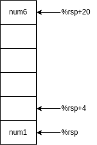
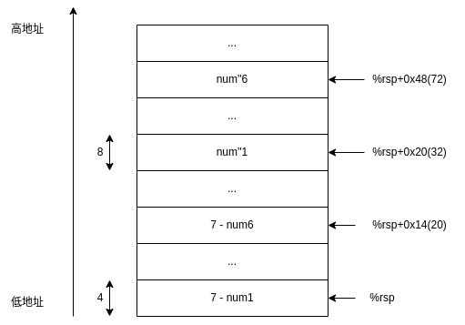

<!-- @import "[TOC]" {cmd="toc" depthFrom=1 depthTo=6 orderedList=false} -->

<!-- code_chunk_output -->

- [简介](#简介)
- [bomb1](#bomb1)
- [bomb2](#bomb2)
- [bomb3](#bomb3)
- [bomb4](#bomb4)
- [bomb5](#bomb5)
- [bomb6](#bomb6)
- [总结](#总结)
- [用到的汇编代码](#用到的汇编代码)

<!-- /code_chunk_output -->

## 简介
----

csapp bomb逆向工程实验。
环境：ubuntu20.04，x86-64
工具：gcc、gdb、objdump
>csapp栈帧习惯：从下往上是地址增大方向，栈向下（低地址方向）增长。
不同机器上使用gdb反汇编得到的虚拟地址可能不同。

为了避免重复输入已经解决的密码，可以从文件输入密码，详见[总结](#总结)。在做csapp的每个实验之前都看一下`README`和`WRITEUP`。

## bomb1
----

在`phase_1`处打断点，反汇编输出如下：
```c
(gdb) disas
Dump of assembler code for function phase_1:
=> 0x0000000000400ee0 <+0>:	sub    $0x8,%rsp
   0x0000000000400ee4 <+4>:	mov    $0x402400,%esi
   0x0000000000400ee9 <+9>:	callq  0x401338 <strings_not_equal>
   0x0000000000400eee <+14>:	test   %eax,%eax
   0x0000000000400ef0 <+16>:	je     0x400ef7 <phase_1+23>
   0x0000000000400ef2 <+18>:	callq  0x40143a <explode_bomb>
   0x0000000000400ef7 <+23>:	add    $0x8,%rsp
   0x0000000000400efb <+27>:	retq
```
显然，`strings_not_equal`函数用于判断输入字符串是否和bomb1密码相等，在调用函数之前会将参数传入寄存器（大于6个的参数会传入栈帧），所以`nexti 2`运行到函数调用前，打印`0x402400`处有什么：

```c
(gdb) print (char*)($esi)
$3 = 0x402400 "Border relations with Canada have never been better."
```
第一个炸弹密码为：`Border relations with Canada have never been better.`


## bomb2
----

1. 同样在`phase_2`打断点。
   ```c
   (gdb) disas
   Dump of assembler code for function phase_2:
      0x0000000000400efc <+0>:	push   %rbp
      0x0000000000400efd <+1>:	push   %rbx
      0x0000000000400efe <+2>:	sub    $0x28,%rsp
      0x0000000000400f02 <+6>:	mov    %rsp,%rsi
      0x0000000000400f05 <+9>:	callq  0x40145c <read_six_numbers>
      0x0000000000400f0a <+14>:	cmpl   $0x1,(%rsp)  ;用%rsp寄存器里的值减1
      0x0000000000400f0e <+18>:	je     0x400f30 <phase_2+52>    ；结果等于0则跳转，否则爆炸
   => 0x0000000000400f10 <+20>:	callq  0x40143a <explode_bomb>
      0x0000000000400f15 <+25>:	jmp    0x400f30 <phase_2+52>
      0x0000000000400f17 <+27>:	mov    -0x4(%rbx),%eax
      0x0000000000400f1a <+30>:	add    %eax,%eax
      0x0000000000400f1c <+32>:	cmp    %eax,(%rbx)
      0x0000000000400f1e <+34>:	je     0x400f25 <phase_2+41>
      0x0000000000400f20 <+36>:	callq  0x40143a <explode_bomb>
      0x0000000000400f25 <+41>:	add    $0x4,%rbx
      0x0000000000400f29 <+45>:	cmp    %rbp,%rbx
      0x0000000000400f2c <+48>:	jne    0x400f17 <phase_2+27>
      0x0000000000400f2e <+50>:	jmp    0x400f3c <phase_2+64>
      0x0000000000400f30 <+52>:	lea    0x4(%rsp),%rbx
      0x0000000000400f35 <+57>:	lea    0x18(%rsp),%rbp
      0x0000000000400f3a <+62>:	jmp    0x400f17 <phase_2+27>
      0x0000000000400f3c <+64>:	add    $0x28,%rsp
      0x0000000000400f40 <+68>:	pop    %rbx
      0x0000000000400f41 <+69>:	pop    %rbp
      0x0000000000400f42 <+70>:	retq   
   End of assembler dump.
   ```

   进入`read_six_numbers`函数，打断点：

   ```c
   (gdb) disas
   Dump of assembler code for function read_six_numbers:
   => 0x000000000040145c <+0>:	sub    $0x18,%rsp
      0x0000000000401460 <+4>:	mov    %rsi,%rdx
      0x0000000000401463 <+7>:	lea    0x4(%rsi),%rcx
      0x0000000000401467 <+11>:	lea    0x14(%rsi),%rax
      0x000000000040146b <+15>:	mov    %rax,0x8(%rsp)
      0x0000000000401470 <+20>:	lea    0x10(%rsi),%rax
      0x0000000000401474 <+24>:	mov    %rax,(%rsp)
      0x0000000000401478 <+28>:	lea    0xc(%rsi),%r9
      0x000000000040147c <+32>:	lea    0x8(%rsi),%r8
      0x0000000000401480 <+36>:	mov    $0x4025c3,%esi
      0x0000000000401485 <+41>:	mov    $0x0,%eax
      0x000000000040148a <+46>:	callq  0x400bf0 <__isoc99_sscanf@plt>   ;int sscanf(const char *str, const char *format, ...)如果成功返回format对应参数个数
      0x000000000040148f <+51>:	cmp    $0x5,%eax
      0x0000000000401492 <+54>:	jg     0x401499 <read_six_numbers+61>   ;jg:有符号大于则跳转
      0x0000000000401494 <+56>:	callq  0x40143a <explode_bomb>
      0x0000000000401499 <+61>:	add    $0x18,%rsp
      0x000000000040149d <+65>:	retq   
   End of assembler dump.
   ```

   调用了`sscanf`,查看`0x4025c3`：
   ```c
   (gdb) print (char*)0x4025c3
   $16 = 0x4025c3 "%d %d %d %d %d %d"
   ```
   显然，bomb2密码为6个int，注意有空格。如果输入的不是6个整数，返回`EOF`即0x1，`cmp    $0x5,%eax`不通过，爆炸。
    
2. 回到phase_2函数
   ```c
   (gdb) disas
   Dump of assembler code for function phase_2:
      0x0000000000400efc <+0>:	push   %rbp
      0x0000000000400efd <+1>:	push   %rbx
      0x0000000000400efe <+2>:	sub    $0x28,%rsp
      0x0000000000400f02 <+6>:	mov    %rsp,%rsi
      0x0000000000400f05 <+9>:	callq  0x40145c <read_six_numbers>
      0x0000000000400f0a <+14>:	cmpl   $0x1,(%rsp)  ;用%rsp寄存器里的值减1
      0x0000000000400f0e <+18>:	je     0x400f30 <phase_2+52>    ；结果等于0则跳转，否则爆炸
   => 0x0000000000400f10 <+20>:	callq  0x40143a <explode_bomb>
      0x0000000000400f15 <+25>:	jmp    0x400f30 <phase_2+52>
      0x0000000000400f17 <+27>:	mov    -0x4(%rbx),%eax
      0x0000000000400f1a <+30>:	add    %eax,%eax
      0x0000000000400f1c <+32>:	cmp    %eax,(%rbx)
      0x0000000000400f1e <+34>:	je     0x400f25 <phase_2+41>
      0x0000000000400f20 <+36>:	callq  0x40143a <explode_bomb>
      0x0000000000400f25 <+41>:	add    $0x4,%rbx
      0x0000000000400f29 <+45>:	cmp    %rbp,%rbx
      0x0000000000400f2c <+48>:	jne    0x400f17 <phase_2+27>
      0x0000000000400f2e <+50>:	jmp    0x400f3c <phase_2+64>
      0x0000000000400f30 <+52>:	lea    0x4(%rsp),%rbx
      0x0000000000400f35 <+57>:	lea    0x18(%rsp),%rbp
      0x0000000000400f3a <+62>:	jmp    0x400f17 <phase_2+27>
      0x0000000000400f3c <+64>:	add    $0x28,%rsp
      0x0000000000400f40 <+68>:	pop    %rbx
      0x0000000000400f41 <+69>:	pop    %rbp
      0x0000000000400f42 <+70>:	retq   
   End of assembler dump.
   ```

   在`0x400f0a`处（即read_six_number函数下一条指令）打断点，查看栈帧，里面依次存放输入的6个整数（int类型长度为4个字节），这里我输入`1 2 3 4 5 6`用于调试：
   ```c
   (gdb) print /x *(int*) ($rsp)
   $47 = 0x1
   (gdb) print /x *(int*) ($rsp+4)
   $48 = 0x2
   (gdb) print /x *(int*) ($rsp+8)
   $49 = 0x3
   (gdb) print /x *(int*) ($rsp+12)
   $50 = 0x4
   (gdb) print /x *(int*) ($rsp+16)
   $51 = 0x5
   (gdb) print /x *(int*) ($rsp+20)
   $52 = 0x6
   ```
   

   观察`read_six_number`后3条指令：
   ```c
      0x0000000000400f0a <+14>:	cmpl   $0x1,(%rsp)  ;用%rsp寄存器里的值减1
      0x0000000000400f0e <+18>:	je     0x400f30 <phase_2+52>    ；结果等于0则跳转，否则爆炸
   => 0x0000000000400f10 <+20>:	callq  0x40143a <explode_bomb>
   ```
   显然`num1 = 1`。

3. 在`0x400f30`处打断点
   ```c
         0x0000000000400f30 <+52>:	lea    0x4(%rsp),%rbx   ；%rbx存放num2的地址
         0x0000000000400f35 <+57>:	lea    0x18(%rsp),%rbp  ；%rbp存放%rsp+0x18（24）的地址，即0x7fffffffd518
         0x0000000000400f3a <+62>:	jmp    0x400f17 <phase_2+27>
   ```
   这个`%rbp`很可疑，查看一下，是`skip`函数的地址,应该是跳过第1个整数。
   ```c
   (gdb) print (char*)0x401431
   $57 = 0x401431 <skip+56> "\205\300u\305H\211\330[\303H\203\354\b\277\243%@"
   (gdb) 
   ```

4. 继续往下看：
   ```c
      0x0000000000400f17 <+27>:	mov    -0x4(%rbx),%eax  ;(%eax)=上一个num
   => 0x0000000000400f1a <+30>:	add    %eax,%eax  ;(%eax)=上一个num*2
      0x0000000000400f1c <+32>:	cmp    %eax,(%rbx)   ;对比(%eax)和当前num
      0x0000000000400f1e <+34>:	je     0x400f25 <phase_2+41>
      0x0000000000400f20 <+36>:	callq  0x40143a <explode_bomb>
   ```
   显然，`num2 = 2`。

5. `nexti`继续往下执行：
   ```c
      0x0000000000400f25 <+41>:	add    $0x4,%rbx  ;检测下一个数
   => 0x0000000000400f29 <+45>:	cmp    %rbp,%rbx  ;对比2个地址
      0x0000000000400f2c <+48>:	jne    0x400f17 <phase_2+27>  ；相等时说明6个数都检测完毕且正确，否则循环
      0x0000000000400f2e <+50>:	jmp    0x400f3c <phase_2+64>
      ...
      0x0000000000400f3c <+64>:	add    $0x28,%rsp
      0x0000000000400f40 <+68>:	pop    %rbx
      0x0000000000400f41 <+69>:	pop    %rbp
      0x0000000000400f42 <+70>:	retq
   ```
   显然，这里是一个循环，每次都是和上一个数*2相比，不相等则爆炸。

第二个炸弹密码为`1 2 4 8 16 32`。


## bomb3
----
1. 在`phase_3`打断点：
   ```c
   (gdb) disas
   Dump of assembler code for function phase_3:
   => 0x0000000000400f43 <+0>:	sub    $0x18,%rsp
      0x0000000000400f47 <+4>:	lea    0xc(%rsp),%rcx
      0x0000000000400f4c <+9>:	lea    0x8(%rsp),%rdx
      0x0000000000400f51 <+14>:	mov    $0x4025cf,%esi
      0x0000000000400f56 <+19>:	mov    $0x0,%eax
      0x0000000000400f5b <+24>:	callq  0x400bf0 <__isoc99_sscanf@plt>
      0x0000000000400f60 <+29>:	cmp    $0x1,%eax
      0x0000000000400f63 <+32>:	jg     0x400f6a <phase_3+39>
      0x0000000000400f65 <+34>:	callq  0x40143a <explode_bomb>
      0x0000000000400f6a <+39>:	cmpl   $0x7,0x8(%rsp)
      0x0000000000400f6f <+44>:	ja     0x400fad <phase_3+106>
      0x0000000000400f71 <+46>:	mov    0x8(%rsp),%eax
      0x0000000000400f75 <+50>:	jmpq   *0x402470(,%rax,8)
      0x0000000000400f7c <+57>:	mov    $0xcf,%eax    ;207
      0x0000000000400f81 <+62>:	jmp    0x400fbe <phase_3+123>
      0x0000000000400f83 <+64>:	mov    $0x2c3,%eax   ;707
      0x0000000000400f88 <+69>:	jmp    0x400fbe <phase_3+123>
      0x0000000000400f8a <+71>:	mov    $0x100,%eax   ；256
      0x0000000000400f8f <+76>:	jmp    0x400fbe <phase_3+123>
      0x0000000000400f91 <+78>:	mov    $0x185,%eax   ;389
      0x0000000000400f96 <+83>:	jmp    0x400fbe <phase_3+123>
      0x0000000000400f98 <+85>:	mov    $0xce,%eax    ;206
      0x0000000000400f9d <+90>:	jmp    0x400fbe <phase_3+123>
      0x0000000000400f9f <+92>:	mov    $0x2aa,%eax   ;682
      0x0000000000400fa4 <+97>:	jmp    0x400fbe <phase_3+123>
      0x0000000000400fa6 <+99>:	mov    $0x147,%eax   ;327
      0x0000000000400fab <+104>:	jmp    0x400fbe <phase_3+123>
      0x0000000000400fad <+106>:	callq  0x40143a <explode_bomb>
      0x0000000000400fb2 <+111>:	mov    $0x0,%eax
      0x0000000000400fb7 <+116>:	jmp    0x400fbe <phase_3+123>
      0x0000000000400fb9 <+118>:	mov    $0x137,%eax   ；311
      0x0000000000400fbe <+123>:	cmp    0xc(%rsp),%eax   ；311
      0x0000000000400fc2 <+127>:	je     0x400fc9 <phase_3+134>
      0x0000000000400fc4 <+129>:	callq  0x40143a <explode_bomb>
      0x0000000000400fc9 <+134>:	add    $0x18,%rsp
      0x0000000000400fcd <+138>:	retq   
   End of assembler dump.
   ```
   很熟悉，又出现了`sscanf`
   ```c
   (gdb) print (char*)0x4025cf
   $74 = 0x4025cf "%d %d"
   ```
   要求输入两个整数，否则爆炸。num1和num2分别存放在地址`%rsp+8`和`%rsp+12`，因为在`phase_3`开头`%rsp`先减8。

2. 继续往下看
   ```c
   => 0x0000000000400f6a <+39>:	cmpl   $0x7,0x8(%rsp)
      0x0000000000400f6f <+44>:	ja     0x400fad <phase_3+106> ；无符号大于7则跳转
      0x0000000000400f71 <+46>:	mov    0x8(%rsp),%eax
      0x0000000000400f75 <+50>:	jmpq   *0x402470(,%rax,8)
   ```
   显然，`0 ≤ num1 ≤ 7`。

   ```c
   => 0x0000000000400f71 <+46>:	mov    0x8(%rsp),%eax   ;保存num1
      0x0000000000400f75 <+50>:	jmpq   *0x402470(,%rax,8)
   ```
   查看一下`0x402470`地址处，存放了8个跳转地址（64位地址，所以每次+8），根据num1跳转到对应的地址处。
   ```c
   (gdb) print /x *(long*)(0x402470)
   $17 = 0x400f7c
   (gdb) print /x *(long*)(0x402470+8)
   $18 = 0x400fb9
   (gdb) print /x *(long*)(0x402470+16)
   $19 = 0x400f83
   (gdb) print /x *(long*)(0x402470+24)
   $20 = 0x400f8a
   (gdb) print /x *(long*)(0x402470+32)
   $21 = 0x400f91
   (gdb) print /x *(long*)(0x402470+40)
   $22 = 0x400f98
   (gdb) print /x *(long*)(0x402470+48)
   $23 = 0x400f9f
   (gdb) print /x *(long*)(0x402470+56)
   $24 = 0x400fa6
   ```
   下面分别用num1 = 0 ~ 7调试。

3. num1 = 0
   ```c
   => 0x0000000000400f7c <+57>:	mov    $0xcf,%eax ;207
      0x0000000000400f81 <+62>:	jmp    0x400fbe <phase_3+123>
      ...
      0x0000000000400fbe <+123>:	cmp    0xc(%rsp),%eax   ;比较num2和207
      0x0000000000400fc2 <+127>:	je     0x400fc9 <phase_3+134>
      0x0000000000400fc4 <+129>:	callq  0x40143a <explode_bomb>
   ```
   比较num2和207,相等则跳转，否则爆炸。

   
4. num1 = 1 ~ 7
   其他7个数也是一样和某个int比较，相等则跳转，否则爆炸。所以bomb3的密码有8个：
   `0 207`、`1 311`、`2 707`、`3 256`、`4 389`、`5 206`、`6 682`、`7 327`。

## bomb4
----
1. 在`phase4`处打断点：
   ```c
   (gdb) disas
   Dump of assembler code for function phase_4:
   => 0x000000000040100c <+0>:	sub    $0x18,%rsp
      0x0000000000401010 <+4>:	lea    0xc(%rsp),%rcx
      0x0000000000401015 <+9>:	lea    0x8(%rsp),%rdx
      0x000000000040101a <+14>:	mov    $0x4025cf,%esi
      0x000000000040101f <+19>:	mov    $0x0,%eax
      0x0000000000401024 <+24>:	callq  0x400bf0 <__isoc99_sscanf@plt>
      0x0000000000401029 <+29>:	cmp    $0x2,%eax
      0x000000000040102c <+32>:	jne    0x401035 <phase_4+41>
      0x000000000040102e <+34>:	cmpl   $0xe,0x8(%rsp)
      0x0000000000401033 <+39>:	jbe    0x40103a <phase_4+46>
      0x0000000000401035 <+41>:	callq  0x40143a <explode_bomb>
      0x000000000040103a <+46>:	mov    $0xe,%edx
      0x000000000040103f <+51>:	mov    $0x0,%esi
      0x0000000000401044 <+56>:	mov    0x8(%rsp),%edi
      0x0000000000401048 <+60>:	callq  0x400fce <func4>
      0x000000000040104d <+65>:	test   %eax,%eax
      0x000000000040104f <+67>:	jne    0x401058 <phase_4+76>
      0x0000000000401051 <+69>:	cmpl   $0x0,0xc(%rsp)
      0x0000000000401056 <+74>:	je     0x40105d <phase_4+81>
      0x0000000000401058 <+76>:	callq  0x40143a <explode_bomb>
      0x000000000040105d <+81>:	add    $0x18,%rsp
      0x0000000000401061 <+85>:	retq   
   End of assembler dump.
   ```
   查看`0x4025cf`，还是2个整数，num1和num2仍然存放在`%rsp+8`和`%rsp+12`：
   ```c
   (gdb) print (char*)0x4025cf
   $1 = 0x4025cf "%d %d"
   ```

2.  继续往下看：
   ```c
   => 0x000000000040102e <+34>:	cmpl   $0xe,0x8(%rsp)   ;14
      0x0000000000401033 <+39>:	jbe    0x40103a <phase_4+46>
      0x0000000000401035 <+41>:	callq  0x40143a <explode_bomb>
   ```
   num1（无符号）≤14则跳转，否则爆炸。
   ```c
   => 0x000000000040103a <+46>:	mov    $0xe,%edx
      0x000000000040103f <+51>:	mov    $0x0,%esi
      0x0000000000401044 <+56>:	mov    0x8(%rsp),%edi
      0x0000000000401048 <+60>:	callq  0x400fce <func4>
   ```
   `%edi、%esi、%edx`通常用作传递第1~3个参数。猜测`func4`函数传入了三个参数：num1、0、14。

3. 进入`func4`打断点：
   ```c
   (gdb) disas
   Dump of assembler code for function func4:
   => 0x0000000000400fce <+0>:	sub    $0x8,%rsp
      0x0000000000400fd2 <+4>:	mov    %edx,%eax  ;(%eax)=参数3
      0x0000000000400fd4 <+6>:	sub    %esi,%eax  ；(%eax) = (%eax) - 参数2
      0x0000000000400fd6 <+8>:	mov    %eax,%ecx  ；(%ecx)=(%eax)
      0x0000000000400fd8 <+10>:	shr    $0x1f,%ecx ；(%ecx)逻辑右移31位，即清零
      0x0000000000400fdb <+13>:	add    %ecx,%eax  ；(%eax)+0
      0x0000000000400fdd <+15>:	sar    %eax    ；(%eax)逻辑右移1位，即除以2
      0x0000000000400fdf <+17>:	lea    (%rax,%rsi,1),%ecx  ;
      0x0000000000400fe2 <+20>:	cmp    %edi,%ecx
      0x0000000000400fe4 <+22>:	jle    0x400ff2 <func4+36> ;num1>(%ecx)则跳转
      0x0000000000400fe6 <+24>:	lea    -0x1(%rcx),%edx
      0x0000000000400fe9 <+27>:	callq  0x400fce <func4>
      0x0000000000400fee <+32>:	add    %eax,%eax
      0x0000000000400ff0 <+34>:	jmp    0x401007 <func4+57>
      0x0000000000400ff2 <+36>:	mov    $0x0,%eax
      0x0000000000400ff7 <+41>:	cmp    %edi,%ecx
      0x0000000000400ff9 <+43>:	jge    0x401007 <func4+57>
      0x0000000000400ffb <+45>:	lea    0x1(%rcx),%esi
      0x0000000000400ffe <+48>:	callq  0x400fce <func4>
      0x0000000000401003 <+53>:	lea    0x1(%rax,%rax,1),%eax
      0x0000000000401007 <+57>:	add    $0x8,%rsp
      0x000000000040100b <+61>:	retq   
   End of assembler dump.
   ```
   反编译伪代码：
   ```c
   /**
    * num1 = (b-a)/2+a时退出
    * num1 > (b-a)/2+a时，func4(num1,a,num1-1)
    * num1 < (b-a)/2+a时，func4(num1,(b-a)/2+a+1, b)
    * func4作用：找到a和b让num1在a和b中间，会改变%eax和%ecx的值
    * 三个参数分别存放在寄存器%edi、%esi、%edx中。
    */
   int func4(int num1,int a, int b){  //%edi、%esi、%edx
      int x = (b - a) / 2; //(%eax)=(参数3-参数2)/2；
      int y = x + a;       //(%ecx)=(%eax)+参数2；
      if( y <= num1 ){
         x = 0;
         if( y >= num1 ){  //即y = num1
            return;
         }
         else{             //即y < num1
            a = y + 1;
            func4(int num1, int a, int b);
         }
      }
      else{
         b = y - 1;
         func4(int num1, int a, int b);
      }
   }
   func4(num1. 0, 14);
   
4. 为了便于调试，令num1=7
   ```c
      0x000000000040104d <+65>:	test   %eax,%eax
      0x000000000040104f <+67>:	jne    0x401058 <phase_4+76>
      0x0000000000401051 <+69>:	cmpl   $0x0,0xc(%rsp)
      0x0000000000401056 <+74>:	je     0x40105d <phase_4+81>
   => 0x0000000000401058 <+76>:	callq  0x40143a <explode_bomb>
      0x000000000040105d <+81>:	add    $0x18,%rsp
      0x0000000000401061 <+85>:	retq
   ```
   num2=0则跳转，否则爆炸。

所以bomb4的密码：`7 0`。

## bomb5
----
1. 在`phase_5`处打断点：
   ```c
   (gdb) disas
   Dump of assembler code for function phase_5:
   => 0x0000000000401062 <+0>:	push   %rbx
      0x0000000000401063 <+1>:	sub    $0x20,%rsp
      0x0000000000401067 <+5>:	mov    %rdi,%rbx  ；字符串保存到%rbx
      0x000000000040106a <+8>:	mov    %fs:0x28,%rax
      0x0000000000401073 <+17>:	mov    %rax,0x18(%rsp)
      0x0000000000401078 <+22>:	xor    %eax,%eax
      0x000000000040107a <+24>:	callq  0x40131b <string_length>
      0x000000000040107f <+29>:	cmp    $0x6,%eax
      0x0000000000401082 <+32>:	je     0x4010d2 <phase_5+112>
      0x0000000000401084 <+34>:	callq  0x40143a <explode_bomb>
      0x0000000000401089 <+39>:	jmp    0x4010d2 <phase_5+112>
      0x000000000040108b <+41>:	movzbl (%rbx,%rax,1),%ecx
      0x000000000040108f <+45>:	mov    %cl,(%rsp)
      0x0000000000401092 <+48>:	mov    (%rsp),%rdx
      0x0000000000401096 <+52>:	and    $0xf,%edx
      0x0000000000401099 <+55>:	movzbl 0x4024b0(%rdx),%edx
      0x00000000004010a0 <+62>:	mov    %dl,0x10(%rsp,%rax,1)
      0x00000000004010a4 <+66>:	add    $0x1,%rax
      0x00000000004010a8 <+70>:	cmp    $0x6,%rax
      0x00000000004010ac <+74>:	jne    0x40108b <phase_5+41>
      0x00000000004010ae <+76>:	movb   $0x0,0x16(%rsp)
      0x00000000004010b3 <+81>:	mov    $0x40245e,%esi
      0x00000000004010b8 <+86>:	lea    0x10(%rsp),%rdi
      0x00000000004010bd <+91>:	callq  0x401338 <strings_not_equal>
      0x00000000004010c2 <+96>:	test   %eax,%eax
      0x00000000004010c4 <+98>:	je     0x4010d9 <phase_5+119>
      0x00000000004010c6 <+100>:	callq  0x40143a <explode_bomb>
      0x00000000004010cb <+105>:	nopl   0x0(%rax,%rax,1)
      0x00000000004010d0 <+110>:	jmp    0x4010d9 <phase_5+119>
      0x00000000004010d2 <+112>:	mov    $0x0,%eax
      0x00000000004010d7 <+117>:	jmp    0x40108b <phase_5+41>
      0x00000000004010d9 <+119>:	mov    0x18(%rsp),%rax
      0x00000000004010de <+124>:	xor    %fs:0x28,%rax
      0x00000000004010e7 <+133>:	je     0x4010ee <phase_5+140>
      0x00000000004010e9 <+135>:	callq  0x400b30 <__stack_chk_fail@plt>
      0x00000000004010ee <+140>:	add    $0x20,%rsp
      0x00000000004010f2 <+144>:	pop    %rbx
      0x00000000004010f3 <+145>:	retq   
   End of assembler dump.
   ```
   调用了`string_length`函数，如果string长度等于6则跳转，否则爆炸。显然bomb5的密码是长度为6的字符串。`%rdi`存放输入的字符串，保存到`%rbx`。
   ```c
      0x00000000004010d2 <+112>:	mov    $0x0,%eax
      0x00000000004010d7 <+117>:	jmp    0x40108b <phase_5+41>
   ```
   将`%eax`清零并跳转进入循环。

2. 进入循环
   ```c
   => 0x000000000040108b <+41>:	movzbl (%rbx,%rax,1),%ecx  ;(%ecx)=当前字符
      0x000000000040108f <+45>:	mov    %cl,(%rsp) ；字符->栈指针指向的地址
      0x0000000000401092 <+48>:	mov    (%rsp),%rdx   ；字符->%rdx
      0x0000000000401096 <+52>:	and    $0xf,%edx  ;取字符低4位，高4位清零
      0x0000000000401099 <+55>:	movzbl 0x4024b0(%rdx),%edx ；根据输入字符，选取对应字符。
      0x00000000004010a0 <+62>:	mov    %dl,0x10(%rsp,%rax,1)  ;取更新后的字符，保存到(%rsp)+(%rax)+0x10
      0x00000000004010a4 <+66>:	add    $0x1,%rax
      0x00000000004010a8 <+70>:	cmp    $0x6,%rax
      0x00000000004010ac <+74>:	jne    0x40108b <phase_5+41>
   ```
   循环判断6个字符，`%cl`是`%ecx`最低8位。
   查看`0x4024b0`地址处，是一个字符串:
   ```c
   (gdb) print (char*)0x4024b0
   $55 = 0x4024b0 <array> "maduiersnfotvbylSo you think you can stop the bomb with ctrl-c, do you?"
   ```
   >有一个小彩蛋，在`(0x4024b0+'a')`地址处有一个字符串：`"secret phase!"`
   
   循环里每次取字符低4位为索引，在`0x4024b0`地址处的字符串前面的16个乱序字符处（所以前面和0xf进行按位与）得到新的字符。相当于编码，得到新的字符串，放在地址`%rsp+0x10`处。

3. 跳出循环
   ```c
   => 0x00000000004010ae <+76>:	movb   $0x0,0x16(%rsp)
      0x00000000004010b3 <+81>:	mov    $0x40245e,%esi
      0x00000000004010b8 <+86>:	lea    0x10(%rsp),%rdi
      0x00000000004010bd <+91>:	callq  0x401338 <strings_not_equal>
      0x00000000004010c2 <+96>:	test   %eax,%eax
      0x00000000004010c4 <+98>:	je     0x4010d9 <phase_5+119>
      0x00000000004010c6 <+100>:	callq  0x40143a <explode_bomb>
   ```
   显然，这里调用`strings_not_equal`函数，对比`0x40245e`地址处的字符串和编码后的字符串。查看`0x40245e`地址处的字符串:
   ```c
      (gdb) print (char*)($esi)
      $105 = 0x40245e "flyers"
   ```
   对应字符在乱序中的索引为：9、15、14、5、6、7
   ```c
   (gdb) print (char)(0x60+9)
   $131 = 105 'i'
   (gdb) print (char)(0x60+15)
   $132 = 111 'o'
   (gdb) print (char)(0x60+14)
   $133 = 110 'n'
   (gdb) print (char)(0x60+5)
   $134 = 101 'e'
   (gdb) print (char)(0x60+6)
   $135 = 102 'f'
   (gdb) print (char)(0x60+7)
   $136 = 103 'g'
   ```
   逆向得到编码之前的字符串即密码为：`ionefg`。

## bomb6
----
1. 在`phase_6`处打断点：
   ```c
   (gdb) disas
   Dump of assembler code for function phase_6:
   => 0x00000000004010f4 <+0>:	push   %r14
      0x00000000004010f6 <+2>:	push   %r13
      0x00000000004010f8 <+4>:	push   %r12
      0x00000000004010fa <+6>:	push   %rbp
      0x00000000004010fb <+7>:	push   %rbx
      0x00000000004010fc <+8>:	sub    $0x50,%rsp
      0x0000000000401100 <+12>:	mov    %rsp,%r13
      0x0000000000401103 <+15>:	mov    %rsp,%rsi
      0x0000000000401106 <+18>:	callq  0x40145c <read_six_numbers>
      0x000000000040110b <+23>:	mov    %rsp,%r14  ;num1存入(%r14)
      0x000000000040110e <+26>:	mov    $0x0,%r12d
      0x0000000000401114 <+32>:	mov    %r13,%rbp
      0x0000000000401117 <+35>:	mov    0x0(%r13),%eax
      0x000000000040111b <+39>:	sub    $0x1,%eax  ;num1-1
      0x000000000040111e <+42>:	cmp    $0x5,%eax
      0x0000000000401121 <+45>:	jbe    0x401128 <phase_6+52>
      0x0000000000401123 <+47>:	callq  0x40143a <explode_bomb>
      0x0000000000401128 <+52>:	add    $0x1,%r12d
      0x000000000040112c <+56>:	cmp    $0x6,%r12d
      0x0000000000401130 <+60>:	je     0x401153 <phase_6+95>
      0x0000000000401132 <+62>:	mov    %r12d,%ebx
      0x0000000000401135 <+65>:	movslq %ebx,%rax
      0x0000000000401138 <+68>:	mov    (%rsp,%rax,4),%eax
      0x000000000040113b <+71>:	cmp    %eax,0x0(%rbp)
      0x000000000040113e <+74>:	jne    0x401145 <phase_6+81>
      0x0000000000401140 <+76>:	callq  0x40143a <explode_bomb>
      0x0000000000401145 <+81>:	add    $0x1,%ebx
      0x0000000000401148 <+84>:	cmp    $0x5,%ebx
      0x000000000040114b <+87>:	jle    0x401135 <phase_6+65>
      0x000000000040114d <+89>:	add    $0x4,%r13
      0x0000000000401151 <+93>:	jmp    0x401114 <phase_6+32>
      0x0000000000401153 <+95>:	lea    0x18(%rsp),%rsi
      0x0000000000401158 <+100>:	mov    %r14,%rax
      0x000000000040115b <+103>:	mov    $0x7,%ecx
      0x0000000000401160 <+108>:	mov    %ecx,%edx
      0x0000000000401162 <+110>:	sub    (%rax),%edx
      0x0000000000401164 <+112>:	mov    %edx,(%rax)
      0x0000000000401166 <+114>:	add    $0x4,%rax
      0x000000000040116a <+118>:	cmp    %rsi,%rax
      0x000000000040116d <+121>:	jne    0x401160 <phase_6+108>
      0x000000000040116f <+123>:	mov    $0x0,%esi
      0x0000000000401174 <+128>:	jmp    0x401197 <phase_6+163>
      0x0000000000401176 <+130>:	mov    0x8(%rdx),%rdx
      0x000000000040117a <+134>:	add    $0x1,%eax
      0x000000000040117d <+137>:	cmp    %ecx,%eax
      0x000000000040117f <+139>:	jne    0x401176 <phase_6+130>
      0x0000000000401181 <+141>:	jmp    0x401188 <phase_6+148>
      0x0000000000401183 <+143>:	mov    $0x6032d0,%edx
      0x0000000000401188 <+148>:	mov    %rdx,0x20(%rsp,%rsi,2)
      0x000000000040118d <+153>:	add    $0x4,%rsi
      0x0000000000401191 <+157>:	cmp    $0x18,%rsi
      0x0000000000401195 <+161>:	je     0x4011ab <phase_6+183>
      0x0000000000401197 <+163>:	mov    (%rsp,%rsi,1),%ecx
      0x000000000040119a <+166>:	cmp    $0x1,%ecx
      0x000000000040119d <+169>:	jle    0x401183 <phase_6+143>
      0x000000000040119f <+171>:	mov    $0x1,%eax
      0x00000000004011a4 <+176>:	mov    $0x6032d0,%edx
      0x00000000004011a9 <+181>:	jmp    0x401176 <phase_6+130>
      0x00000000004011ab <+183>:	mov    0x20(%rsp),%rbx
      0x00000000004011b0 <+188>:	lea    0x28(%rsp),%rax
      0x00000000004011b5 <+193>:	lea    0x50(%rsp),%rsi
      0x00000000004011ba <+198>:	mov    %rbx,%rcx
      0x00000000004011bd <+201>:	mov    (%rax),%rdx
      0x00000000004011c0 <+204>:	mov    %rdx,0x8(%rcx)
      0x00000000004011c4 <+208>:	add    $0x8,%rax
      0x00000000004011c8 <+212>:	cmp    %rsi,%rax
      0x00000000004011cb <+215>:	je     0x4011d2 <phase_6+222>
      0x00000000004011cd <+217>:	mov    %rdx,%rcx
      0x00000000004011d0 <+220>:	jmp    0x4011bd <phase_6+201>
      0x00000000004011d2 <+222>:	movq   $0x0,0x8(%rdx)
      0x00000000004011da <+230>:	mov    $0x5,%ebp
      0x00000000004011df <+235>:	mov    0x8(%rbx),%rax
      0x00000000004011e3 <+239>:	mov    (%rax),%eax
      0x00000000004011e5 <+241>:	cmp    %eax,(%rbx)
      0x00000000004011e7 <+243>:	jge    0x4011ee <phase_6+250>
      0x00000000004011e9 <+245>:	callq  0x40143a <explode_bomb>
      0x00000000004011ee <+250>:	mov    0x8(%rbx),%rbx
      0x00000000004011f2 <+254>:	sub    $0x1,%ebp
      0x00000000004011f5 <+257>:	jne    0x4011df <phase_6+235>
      0x00000000004011f7 <+259>:	add    $0x50,%rsp
      0x00000000004011fb <+263>:	pop    %rbx
      0x00000000004011fc <+264>:	pop    %rbp
      0x00000000004011fd <+265>:	pop    %r12
      0x00000000004011ff <+267>:	pop    %r13
      0x0000000000401201 <+269>:	pop    %r14
      0x0000000000401203 <+271>:	retq   
   End of assembler dump.
   ```
   bomb6的密码同样为6个整数，存放在地址`%rsp`~`%rsp+20`中，注意int大小为4Byte。
   读完6个整数后进入循环。

2. 进入循环1
   循环前，%r13、%r14、%rsi都等于%rsp，存放num1的地址。%r12d=0
   ```c
      0x0000000000401114 <+32>:	mov    %r13,%rbp
      0x0000000000401117 <+35>:	mov    0x0(%r13),%eax
      0x000000000040111b <+39>:	sub    $0x1,%eax
      0x000000000040111e <+42>:	cmp    $0x5,%eax
      0x0000000000401121 <+45>:	jbe    0x401128 <phase_6+52>
      0x0000000000401123 <+47>:	callq  0x40143a <explode_bomb>
   => 0x0000000000401128 <+52>:	add    $0x1,%r12d
      0x000000000040112c <+56>:	cmp    $0x6,%r12d
      0x0000000000401130 <+60>:	je     0x401153 <phase_6+95>
      0x0000000000401132 <+62>:	mov    %r12d,%ebx
      0x0000000000401135 <+65>:	movslq %ebx,%rax
      0x0000000000401138 <+68>:	mov    (%rsp,%rax,4),%eax
      0x000000000040113b <+71>:	cmp    %eax,0x0(%rbp)
      0x000000000040113e <+74>:	jne    0x401145 <phase_6+81>
      0x0000000000401140 <+76>:	callq  0x40143a <explode_bomb>
      0x0000000000401145 <+81>:	add    $0x1,%ebx
      0x0000000000401148 <+84>:	cmp    $0x5,%ebx
      0x000000000040114b <+87>:	jle    0x401135 <phase_6+65>
      0x000000000040114d <+89>:	add    $0x4,%r13
      0x0000000000401151 <+93>:	jmp    0x401114 <phase_6+32>
   ```
   反编译伪代码：
   ```c
   /**
    * 0 < num1~6 < 7，且6个数不能相等
    */
   rbp = r13;
   eax = *(r13);
   eax += 1;
   if( eax > 5 )
      explode_bomb();
   for ( r12d == 1; r12d < 6; r12d++ ){
      for ( ebx = r12d; ebx <= 5; ebx ++ ){
         rax = ebx;
         eax = *(rsp + rax * 4);
         if ( eax == *(rbp) )
            explode_bomb();
         ebx += 1;
      }
      r13 += 4;

      rbp = r13;
      eax = *(r13);
      if( eax > 5 )
         explode_bomb();
   }
   ```
   双层循环用于判断当前数不能和后面的数相等。注意这里先减1再判断，所以num不能为0。

3. 用`1 2 3 4 5 6`调试，跳出循环1，进入循环2
   进入循环前，%rsi = *(%rsp+0x18), %rax = %r14 = %rsp，%ecx=0x7。地址`%rsp+0x14`处存放num6。
   ```c
   => 0x0000000000401160 <+108>:	mov    %ecx,%edx
      0x0000000000401162 <+110>:	sub    (%rax),%edx
      0x0000000000401164 <+112>:	mov    %edx,(%rax)
      0x0000000000401166 <+114>:	add    $0x4,%rax
      0x000000000040116a <+118>:	cmp    %rsi,%rax
      0x000000000040116d <+121>:	jne    0x401160 <phase_6+108>
   ```
   用0x7减去num1-6，编码后取值范围1-6，设为num'1~6;。

4. 进入循环3
   ```c
      0x000000000040116f <+123>:	mov    $0x0,%esi  ；清0
      0x0000000000401174 <+128>:	jmp    0x401197 <phase_6+163>
   => 0x0000000000401176 <+130>:	mov    0x8(%rdx),%rdx
      0x000000000040117a <+134>:	add    $0x1,%eax
      0x000000000040117d <+137>:	cmp    %ecx,%eax
      0x000000000040117f <+139>:	jne    0x401176 <phase_6+130>
      0x0000000000401181 <+141>:	jmp    0x401188 <phase_6+148>
      0x0000000000401183 <+143>:	mov    $0x6032d0,%edx
      0x0000000000401188 <+148>:	mov    %rdx,0x20(%rsp,%rsi,2)
      0x000000000040118d <+153>:	add    $0x4,%rsi
      0x0000000000401191 <+157>:	cmp    $0x18,%rsi
      0x0000000000401195 <+161>:	je     0x4011ab <phase_6+183>
      0x0000000000401197 <+163>:	mov    (%rsp,%rsi,1),%ecx
      0x000000000040119a <+166>:	cmp    $0x1,%ecx
      0x000000000040119d <+169>:	jle    0x401183 <phase_6+143>
      0x000000000040119f <+171>:	mov    $0x1,%eax
      0x00000000004011a4 <+176>:	mov    $0x6032d0,%edx
      0x00000000004011a9 <+181>:	jmp    0x401176 <phase_6+130>
   ```
   反汇编伪代码：
   ```c
   /**
    * 作用：在地址`%rsp+0x20`到`%rsp+0x20+0x18`处存放8个64位地址。
    * num'=1-6时分别对应：0x6032d0,0x6032e0,0x6032f0,0x603300,0x603310,0x603320。
    * 记为num''1-6。
    */
   for ( rsi = 0; rsi < 0x18; rsi += 4 ){
      ecx = *(rsp+rsi);  // ecx依次取num1~6
      if ( ecx <= 1 ){  // *(rsp+0x20+rsi*2) = 0x6032d0;
         edx = 0x6032d0;
         *(rsp+rsi*2+0x20) = rdx;
      }
      else{ // 2~6:0x6032e0,0x6032f0,0x603300,0x603310,0x603320
         eax = 1;
         edx = 0x6032d0;
         do{
            rdx = *(rdx+8); //注意这里不是顺序存储，类似与一个链表
            eax += 1;
         }while( eax != ecx );
         *(rsp+rsi*2+0x20) = rdx;
      }
   }
   ```
   当num=2~6时，分别为：
   ```c
   (gdb) print /x *(long*)(0x6032d0+8)
   $99 = 0x6032e0
   (gdb) print /x *(long*)(0x6032e0+8)
   $100 = 0x6032f0'
   (gdb) print /x *(long*)(0x6032f0+8)
   $101 = 0x603300
   (gdb) print /x *(long*)(0x603300+8)
   $102 = 0x603310
   (gdb) print /x *(long*)(0x603310+8)
   $103 = 0x603320
   ```

5. 下面进入循环4
   ```c
      0x00000000004011ab <+183>:	mov    0x20(%rsp),%rbx
      0x00000000004011b0 <+188>:	lea    0x28(%rsp),%rax
      0x00000000004011b5 <+193>:	lea    0x50(%rsp),%rsi
      0x00000000004011ba <+198>:	mov    %rbx,%rcx
   => 0x00000000004011bd <+201>:	mov    (%rax),%rdx
      0x00000000004011c0 <+204>:	mov    %rdx,0x8(%rcx)
      0x00000000004011c4 <+208>:	add    $0x8,%rax
      0x00000000004011c8 <+212>:	cmp    %rsi,%rax
      0x00000000004011cb <+215>:	je     0x4011d2 <phase_6+222> ;跳出循环
      0x00000000004011cd <+217>:	mov    %rdx,%rcx
      0x00000000004011d0 <+220>:	jmp    0x4011bd <phase_6+201>
   ```
   反汇编伪代码：
   ```c
   /**
    * 作用：*(*num''1+8) =rdx  =*num''2
           *(*num''2+8) =rdx  =*num''3
           ...
           *(*num''5+8) =rdx  =*num''6
    */
   rbx = *(rsp+0x20); // *num''1
   rax = rsp+0x28; // num''2
   rsi = rsp+0x50; // 栈底地址
   
   rcx = rbx;  // *num''1
   *(rcx+8) = rdx = *(rax);  // *(*num''1+8)=rdx=*num''2
   rax += 8; // num''3
   while( rax != rsi ){
      rcx = rdx;  
      *(rcx+8) = rdx = *(rax);
      rax += 8; 
   }
   ```

6. 进入循环5
   `%rbx`寄存器在循环4里存放*num''1
   ```c
      0x00000000004011d2 <+222>:	movq   $0x0,0x8(%rdx)
      0x00000000004011da <+230>:	mov    $0x5,%ebp
   => 0x00000000004011df <+235>:	mov    0x8(%rbx),%rax
      0x00000000004011e3 <+239>:	mov    (%rax),%eax
      0x00000000004011e5 <+241>:	cmp    %eax,(%rbx)
      0x00000000004011e7 <+243>:	jge    0x4011ee <phase_6+250>
      0x00000000004011e9 <+245>:	callq  0x40143a 
      <explode_bomb>
      0x00000000004011ee <+250>:	mov    0x8(%rbx),%rbx
      0x00000000004011f2 <+254>:	sub    $0x1,%ebp
      0x00000000004011f5 <+257>:	jne    0x4011df <phase_6+235>
   ```
   反汇编伪代码：
   ```c
   /**
    * 循环前，rbx = *num''1
    * 作用：**num''1 >= **num''2
           **num''2 >= **num''3
           **num''3 >= **num''4
           **num''4 >= **num''5
           **num''5 >= **num''6
    */
   *(rdx+8) = 0;
   for ( ebp = 5; ebp > 0; ebp -- ){   //下面给出第一次循环的注释
      rax = *(rbx+8);   // = *(*num''1+8) = *num''2
      eax = *(rax);     // **num''2
      if( *(rbx) < eax )
         explode_bomb();
      rbx = *(rbx+8);   // = *num''2
   }
   ```
   已知，在地址`%rsp+0x20`到`%rsp+0x20+0x18`处存放8个64位地址。num'=1-6时分别对应：0x6032d0、0x6032e0、0x6032f0、0x603300、0x603310、0x603320。每个地址都存放了一个int，分别为：332、168、924、691、477、443。
   
   
   
而循环5要求降序，所以num'1-6 = 3 4 5 6 1 2，显然bomb6密码为：`4 3 2 1 6 5`。


## 总结
----

1. 
   ```c
   (gdb) run
   The program being debugged has been started already.
   Start it from the beginning? (y or n) y
   Starting program: /home/enterprise/github/csapp/bomb/bomb 
   Welcome to my fiendish little bomb. You have 6 phases with
   which to blow yourself up. Have a nice day!
   Border relations with Canada have never been better.
   Phase 1 defused. How about the next one?
   1 2 4 8 16 32
   That's number 2.  Keep going!
   0 207
   Halfway there!
   7 0
   So you got that one.  Try this one.
   ionefg
   Good work!  On to the next...
   4 3 2 1 6 5
   Congratulations! You've defused the bomb!
   [Inferior 1 (process 7743) exited normally]
   ```
   其中bomb3有8种答案。

2. 从文件中输入
	为了避免每次都要重新输入已经解决的炸弹，可以从文件中输入。比如新建一个名为`psol.txt`的文件，每一个密码都要以回车结尾（所以最后一行是空行）：
	```
	Border relations with Canada have never been better.
	1 2 4 8 16 32
	0 207
	7 0
	ionefg
	4 3 2 1 6 5
	```
   
	然后在命令行中输入：
	```bash
	./bomb psol.txt
	```

3. 逆向工程循环
   >理解汇编代码与原始代码之间的关系，关键是找到程序值和寄存器之间的映射关系。看看在循环之前如何初始化寄存器，在循环中如何更新和测试寄存器，以及在循环之后又如何使用寄存器。根据经验，GCC常常做一些变换，非但不能带来性能好处，反而甚至可能降低代码性能。
   
   对循环进行逆向工程时，最好根据反汇编得到的机器码写成伪代码，更容易理解。

## 用到的汇编代码
----

cmp 不改变源和目的操作数的值
je 跳转地址    ；结果等于0则跳转
jne 跳转地址   ；结果非零则跳转
jg 跳转地址    ；有符号大于则跳转
jge 跳转地址   ；有符号大于等于则跳转
ja 跳转地址    ；无符号大于则跳转
jmpq 跳转地址  ；跳转到64位地址处
jbe 跳转地址   ；无符号小于等于则跳转
jle 跳转地址   ；有符号小于等于则跳转
cmpl  D, S     ；用源操作数减目的操作数，根据结果改变状态寄存器
LEA S, D       ；取源操作数地址的偏移量，并把它传送到目的操作数所在的单元。
test A, B      ；逻辑与运算，结果设置标志寄存器。
shr k, D       ；逻辑右移k位，高位补0。在多位移操作中，最后一个移出位 0（LSB）的数值进入进位标志位（CF）：
movzbl S,D     ;将做了零拓展的字传送到双字
